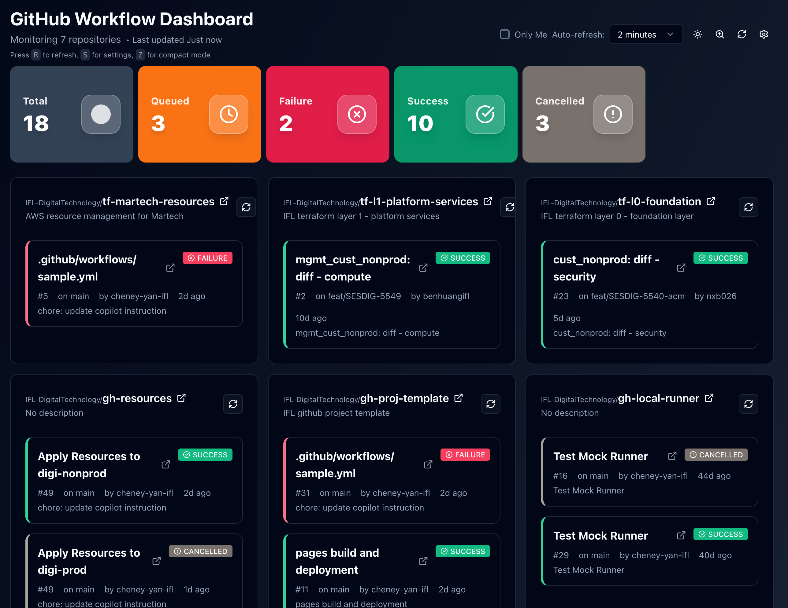
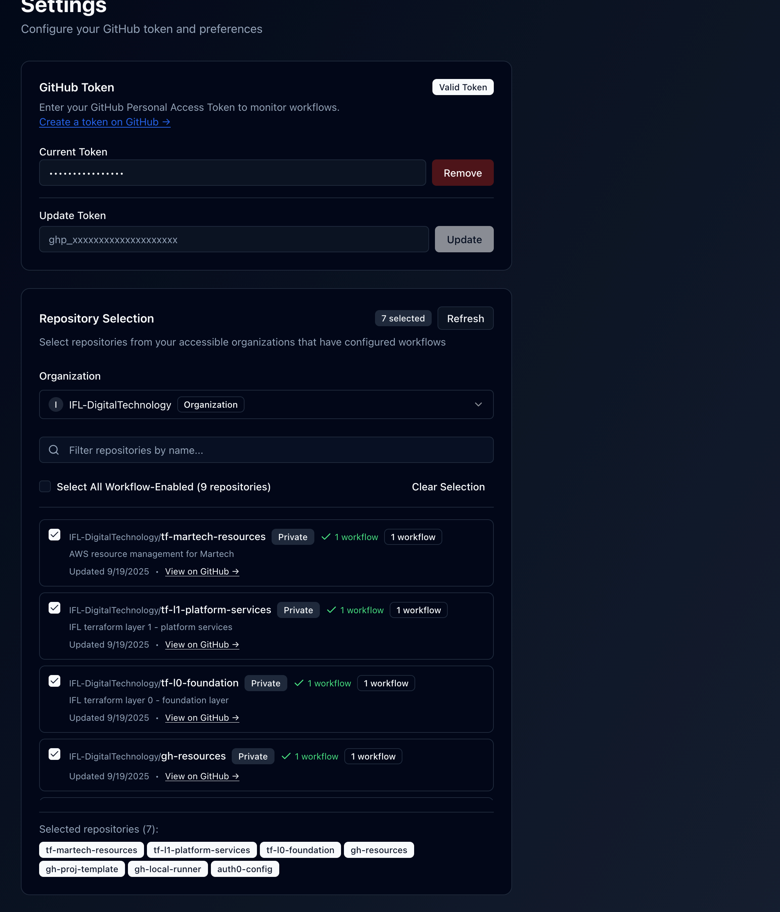
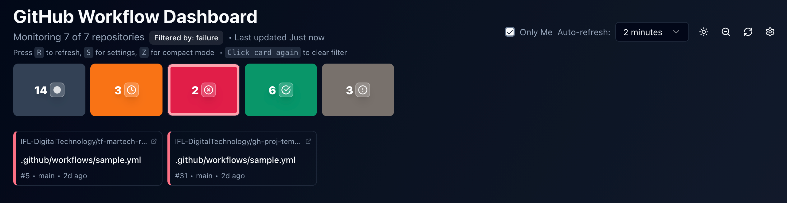

# Github Workflow Dashboard

Online demonstration

https://github-workflow-dashboard.vercel.app

All data stored on your browser.

## Introduction

Github Workflow Dashboard is a web app for visualizing, monitoring, and managing GitHub Actions workflows across multiple repositories and organizations. It provides a unified dashboard to track workflow status, recent runs, and repository health, making it easy for teams to stay on top of CI/CD activity.

### Main Features

- View workflow status and history for multiple repositories
- Monitor recent runs and repository health
- Manage GitHub tokens and settings
- Easy deployment options (npm, Docker, Vercel)

### Screenshots

**Main Page**



**Settings Page**



**Various Modes**

Various filters and compact mode, mobile friendly



## Quick Start

### 1. Run with npm

```bash
npm install
npm start
```

This will start the development server. Open your browser to `http://localhost:3000` to view the dashboard.

### 2. Build Static Files and Serve Locally/CDN

```bash
npm install
npm run build
npm run export
```

The static files will be generated in the `out`. You can serve these files locally with a static server:

```bash
npx serve out
```

Or upload the static files to your preferred CDN for production hosting.

### 3. Run with Docker (docker-compose)

Build and start the dashboard using Docker Compose:

```bash
docker-compose up --build
```

This will build the Docker image and start the dashboard at `http://localhost:3000`.

To stop and remove containers:

```bash
docker-compose down
```

### 4. Deploy with Vercel

[](https://vercel.com/new/clone?repository-url=https%3A%2F%2Fgithub.com%cheney-yan-ifl%2Fgithub-workflow-dashboard)
